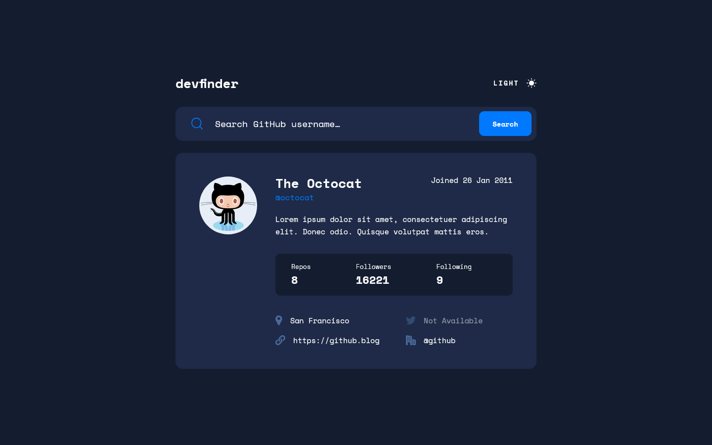

# Frontend Mentor - GitHub user search app solution

This is a solution to the [GitHub user search app challenge on Frontend Mentor](https://www.frontendmentor.io/challenges/github-user-search-app-Q09YOgaH6). Frontend Mentor challenges help you improve your coding skills by building realistic projects.

### Screenshot

### Links

- Solution URL: [Solution URL here](https://github.com/NDK1195/intro-component-with-signup-form)
- Live Site URL: [Live site URL here](https://intro-component-with-signup-form-blue-tau.vercel.app/)

### Built with

- React
- Tailwind CSS
